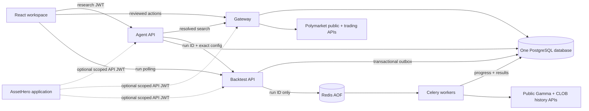

# PolyTrade

PolyTrade is a Polymarket research, paper-trading, single-market backtesting,
and reviewed real-order application. Natural-language chat can find a resolved
binary market and queue the deterministic `momentum_v1` replay. Redis and Celery
provide the asynchronous work queue; PostgreSQL remains the authoritative source
for run state, results, and each user's isolated virtual-USDC ledger.

Real trading stays on a separate path. The model can prepare an unsigned action,
but only the browser wallet can sign it and only the gateway can submit it. The
backtest API and workers contain no wallet, signing, submission, or cancellation
code.

## Runtime



The standalone web application always uses PolyTrade's Clerk instance.
AssetHero is an optional external API client with its own issuer and JWKS; it is
not a frontend login mode. Clerk and AssetHero owners remain separate,
namespaced principals.

Every server receives the same `DATABASE_URL` and database identity. Application
data is separated only by PostgreSQL schema:

| Schema | Contents | Default search path |
| --- | --- | --- |
| `polytrade` | Trading gateway state and audit | `polytrade, public` |
| `polytrade_agent` | Threads, runs, encrypted checkpoints | `polytrade_agent, public` |
| `polytrade_backtest` | Runs, outbox, datasets, trades, metrics, series | `polytrade_backtest, public` |

The gateway executes the idempotent empty-database bootstrap under a PostgreSQL
advisory lock before it serves traffic. Agent and backtest services wait for the
gateway health check. No service-specific databases, database roles, database
URLs, or bootstrap containers are used, and `public` contains no application
tables.

## Repository

- `services/agent` — Deep Agent, FastAPI/SSE runtime, encrypted checkpoints, and backtest tools.
- `services/backtest` — FastAPI control API, Decimal engine, PostgreSQL repositories, and Celery task.
- `apps/gateway` — Fastify API, resolved/active market search, paper ledger, trading controls, and bootstrap.
- `apps/web` — React Chat, Trades, Paper, and Backtests workspaces.
- `packages/contracts` — matching browser/gateway Zod contracts.

## Local setup

PolyTrade always uses an existing remote PostgreSQL 16+ database, including
when the application is run locally. Local tooling requires Python 3.12, uv,
Node 20+, pnpm 10, Redis 7+, and Docker Compose for the container stack.

```bash
cp .env.example .env
# Fill the required secrets and remote DATABASE_URL.
pnpm install
uv sync --project services/agent
uv sync --project services/backtest
docker compose up --build
```

Compose never provisions PostgreSQL. The gateway bootstraps the three schemas
directly in the remote database configured by `DATABASE_URL` before it becomes
healthy.

For processes run directly on the host, keep using the remote database URL and
change the two Redis URL hostnames from `redis` to `localhost`, then start them
in this order:

```bash
pnpm --filter @polytrade/gateway bootstrap
pnpm dev:gateway
pnpm dev:backtest
pnpm dev:backtest-worker
pnpm dev:agent
pnpm dev:web
```

Generate `CREDENTIALS_KEK_BASE64` with `openssl rand -base64 32` and
`LANGGRAPH_AES_KEY` with `openssl rand -hex 16`. Never put a wallet private key,
seed phrase, CLOB secret, user JWT, or wallet signature in an environment file.

## Verification

```bash
pnpm typecheck
pnpm test
pnpm build
pnpm test:agent
pnpm test:backtest
```

The integration suites additionally exercise the bootstrap against a dedicated
remote test database and verify schema resolution, ownership isolation,
idempotency, and dataset deduplication when `TEST_DATABASE_URL` is set. CI uses
mocked market responses; it never contacts live trading endpoints, requires a
wallet, or submits an order.

See `docs/ARCHITECTURE.md`, `docs/ASSETHERO_AUTH.md`, `docs/OPERATIONS.md`, and
`docs/SECURITY.md` for the operating and trust boundaries.
